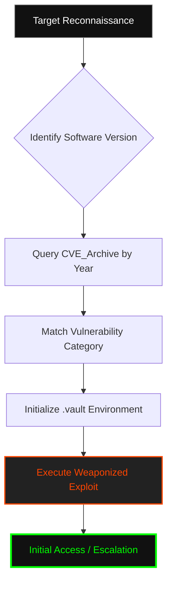

  

<pre>
 ██████ ██    ██ ███████      █████  ██████   ██████ ██   ██ ██ ██    ██ ███████ 
██      ██    ██ ██          ██   ██ ██   ██ ██      ██   ██ ██ ██    ██ ██      
██      ██    ██ █████       ███████ ██████  ██      ███████ ██ ██    ██ █████   
██       ██  ██  ██          ██   ██ ██   ██ ██      ██   ██ ██  ██  ██  ██      
 ██████   ████   ███████     ██   ██ ██   ██  ██████ ██   ██ ██   ████   ███████
</pre>

# <samp>Sub-Sector_0x01_Alpha: CVE_Archive</samp>

**<samp>Chronological Vulnerability Repository | Weaponized Public Disclosures | Historical Attack Matrix</samp>**

 

<samp>Operative: <a href="https://github.com/fsoc-ghost-0x">C0deGhost</a> | Access_Level: LEVEL_4 | Protocol: WINTER_HUNT</samp>

---

<code>Accessing Archive Documentation...</code>

- [▌ 0x01_ARCHIVE_PURPOSE](#-0x01_archive_purpose)
- [▌ 0x02_CHRONOLOGICAL_TAXONOMY](#-0x02_chronological_taxonomy)
- [▌ 0x03_FUNCTIONAL_BLUEPRINT](#-0x03_functional_blueprint)
- [▌ 0x04_WEAPONIZATION_STANDARDS](#-0x04_weaponization_standards)
- [▌ 0x05_OPERATIONAL_LOGIC_FLOW](#-0x05_operational_logic_flow)
- [▌ 0x06_LEGAL_DISCLAIMER](#-0x06_legal_disclaimer)

 

## <samp>▌ <u>0x01_ARCHIVE_PURPOSE</u></samp>

  
<code>Decrypting Archive Intel...</code>

  
  ### <samp>The Historical Doctrine</samp>

  <samp>
  The <code>CVE_Archive</code> is a deterministic collection of weaponized public disclosures. Its primary function is to provide the Operative with a rapid-response library of exploits categorized by their year of discovery. 
  
  Security is a cycle of regression. Old vulnerabilities often resurface in unpatched legacy systems or through the introduction of insecure code in modern environments. This archive ensures that no "solved" problem remains a barrier to access.
  </samp>

  ### <samp>Strategic Function</samp>
  
  **<samp>1. Rapid Weaponization:</samp>** <samp>Pre-configured environments for immediate deployment against identified CVEs.</samp>
  **<samp>2. Regression Testing:</samp>** <samp>Verifying the efficacy of security patches in controlled environments.</samp>
  **<samp>3. Attack Surface Mapping:</samp>** <samp>Correlating target versioning with known historical flaws.</samp>
  
  

     
    <i>"Yesterday's patch is today's entry point."</i>
  

 

## <samp>▌ <u>0x02_CHRONOLOGICAL_TAXONOMY</u></samp>

<samp>The archive is partitioned into annual sectors. Each sector contains vulnerabilities disclosed within that specific timeframe, organized by their impact and target architecture:</samp>

| <samp>Sector</samp> | <samp>Temporal Scope</samp> | <samp>Categorization Focus</samp> |
| :--- | :--- | :--- |
| <samp>📂 **2025**</samp> | <samp>Current Era</samp> | <samp>Cloud-Native Flaws, Logic Corruptions, Modern API Subversion.</samp> |
| <samp>📂 **2024**</samp> | <samp>Active Threats</samp> | <samp>Edge Device Exploitation, Kernel-Level Escapes, Path Overrides.</samp> |
| <samp>📂 **2023**</samp> | <samp>Legacy Active</samp> | <samp>Identity Provider Bypasses, Broken Access Control, Protocol Flaws.</samp> |
| <samp>📂 **2022**</samp> | <samp>Historical Baseline</samp> | <samp>Memory Corruption, Remote Code Execution (RCE), Persistence Vectors.</samp> |

 

## <samp>▌ <u>0x03_FUNCTIONAL_BLUEPRINT</u></samp>

<samp>Each individual CVE directory within the annual sectors is strictly required to maintain the following internal structure:</samp>

1.  **<samp>exploit.py / exploit.c:</samp>** <samp>The primary weaponized code.</samp>
2.  **<samp>README.md:</samp>** <samp>Technical analysis, impact report, and specific usage instructions for that CVE.</samp>
3.  **<samp>requirements.txt:</samp>** <samp>Deterministic dependency list for environment isolation.</samp>
4.  **<samp>assets/:</samp>** <samp>Proof of Concept evidences, packet captures (PCAPs), or debugger logs.</samp>

 

## <samp>▌ <u>0x04_WEAPONIZATION_STANDARDS</u></samp>

<samp>All exploits archived in this sub-sector must adhere to the <code>Alderson_Core</code> standards:</samp>

- **<samp>Stealth:</samp>** <samp>Payloads must be designed to minimize EDR alerts and log generation.</samp>
- **<samp>Portability:</samp>** <samp>Code must be executable within the <code>.vault</code> virtual environment or standard Kali Linux builds.</samp>
- **<samp>Clarity:</samp>** <samp>Surgical comments explaining the exact point of failure in the target software.</samp>

 

## <samp>▌ <u>0x05_OPERATIONAL_LOGIC_FLOW</u></samp>

 

## <samp>▌ <u>0x06_LEGAL_DISCLAIMER</u></samp>
<samp>
The <code>CVE_Archive</code> is a repository of known vulnerabilities. The tools provided here are for authorized Red Team operations and educational research only. Unauthorized use against systems without explicit permission is illegal and unethical. C0deGhost and Fsociety do not assume liability for misuse of this data.
</samp>
 
<i>"Control is an illusion. The archive is the evidence."</i>

---

  <samp><strong>WE ARE FSOCIETY. WE ARE FINALLY FREE. WE ARE FINALLY AWAKE.</strong></samp>

