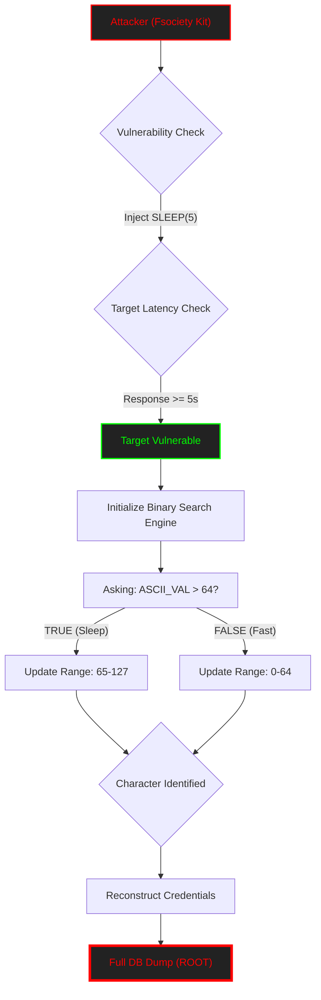

<p align="center">
  
</p>

<p align="center">
<pre>
  ██████   █████   ██▓        ██▓ ███▄    █  ▄▄▄██▀▀▀▓█████  ▄████▄  ▄▄▄█████▓ ██▓ ▒█████   ███▄    █ 
▒██    ▒ ▒██▓  ██▒▓██▒       ▓██▒ ██ ▀█   █    ▒██   ▓█   ▀ ▒██▀ ▀█  ▓  ██▒ ▓▒▓██▒▒██▒  ██▒ ██ ▀█   █ 
░ ▓██▄   ▒██▒  ██░▒██░       ▒██▒▓██  ▀█ ██▒   ░██   ▒███   ▒▓█    ▄ ▒ ▓██░ ▒░▒██▒▒██░  ██▒▓██  ▀█ ██▒
  ▒   ██▒░██  █▀ ░▒██░       ░██░▓██▒  ▐▌██▒▓██▄██▓  ▒▓█  ▄ ▒▓▓▄ ▄██▒░ ▓██▓ ░ ░██░▒██   ██░▓██▒  ▐▌██▒
▒██████▒▒░▒███▒█▄ ░██████▒   ░██░▒██░   ▓██░ ▓███▒   ░▒████▒▒ ▓███▀ ░  ▒██▒ ░ ░██░░ ████▓▒░▒██░   ▓██░
▒ ▒▓▒ ▒ ░░░ ▒▒░ ▒ ░ ▒░▓  ░   ░▓  ░ ▒░   ▒ ▒  ▒▓▒▒░   ░░ ▒░ ░░ ░▒ ▒  ░  ▒ ░░   ░▓  ░ ▒░▒░▒░ ░ ▒░   ▒ ▒ 
░ ░▒  ░ ░ ░ ▒░  ░ ░ ░ ▒  ░    ▒ ░░ ░░   ░ ▒░ ▒ ░▒░    ░ ░  ░  ░  ▒       ░     ▒ ░  ░ ▒ ▒░ ░ ░░   ░ ▒░
░  ░  ░     ░   ░   ░ ░       ▒ ░   ░   ░ ░  ░ ░ ░      ░   ░          ░       ▒ ░░ ░ ░ ▒     ░   ░ ░ 
      ░      ░        ░  ░    ░           ░  ░   ░      ░  ░░ ░                ░      ░ ░           ░ 

[ SECTOR_0x01_ALPHA: CVE-2024-51482 - SQL_INJECTION_ENGINE ]
</pre>
</p>

<div align="center">

# <samp>Fsociety_CVE-2024-51482</samp>

**<samp>Surgical Exfiltrator | ZoneMinder Boolean/Time-Based Blind SQLi</samp>**

<br>

<samp>Architect: <a href="https://github.com/fsoc-ghost-0x">C0deGhost</a> | Version: 1.5.1 (Forensic Edition) | <a href="https://attack.mitre.org/techniques/T1505/003/">MITRE T1505.003</a></samp>

</div>

<div align="center">


</div>

---

<details>
<summary><code>Click to view Table of Contents Fsociety</code></summary>

<br>

- [▌ 0x01_ANALYSIS_&_VULNERABILITY_REPORT](#-0x01_analysis__vulnerability_report)
- [▌ 0x02_MITRE_ATT&CK_MAPPING](#-0x02_mitre_attck_mapping)
- [▌ 0x03_FEATURES_&_ARSENAL](#-0x03_features__arsenal)
- [▌ 0x04_USAGE_&_EXECUTION](#-0x04_usage__execution)
- [▌ 0x05_EXECUTION_&_EVIDENCES](#-0x05_execution__evidences)
- [▌ 0x06_FRAMEWORK_OPTIONS](#-0x06_framework_options)
- [▌ 0x07_LEGAL_DISCLAIMER](#-0x07_legal_disclaimer)

</details>

---

<br>

## <samp>▌ <u>0x01_ANALYSIS_&_VULNERABILITY_REPORT</u></samp>

<details open>
  <summary><code>Click to expand Fsociety Intel Report...</code></summary>
  
  ### <samp>Executive Summary</samp>

  <samp>
  This framework weaponizes **CVE-2024-51482**, a critical Blind SQL Injection vulnerability in <strong>ZoneMinder (v1.37.* <= 1.37.64)</strong>. The flaw resides in the AJAX event management logic, specifically within the <code>removetag</code> action. 
  
  The <code>Fsociety_Exfiltrator.py</code> exploit leverages a Time-Based / Boolean inference engine to bypass front-end protections and extract the entire backend database structure and data, including user credentials and system configurations, through a single authenticated session.
  </samp>

  ### <samp>Forensic Code Dissection (The Root Cause)</samp>
  
  <samp>
  The vulnerability is located in <code>web/ajax/event.php</code>. While the primary <code>DELETE</code> operation is parameterized, the developer introduced a secondary <code>SELECT</code> query that directly concatenates the <code>tid</code> (Tag ID) parameter.
  </samp>
  
  **<samp>The Lethal Flaw:</samp>**
  ```php
  // web/ajax/event.php
  case 'removetag':
      $tagId = $_REQUEST['tid']; // UNTRUSTED USER INPUT
      dbQuery('DELETE FROM Events_Tags WHERE TagId = ? AND EventId = ?', array($tagId, $_REQUEST['id']));
      
      $sql = "SELECT * FROM Events_Tags WHERE TagId = $tagId"; // DIRECT CONCATENATION - VULNERABLE
      $rowCount = dbNumRows($sql); 
  ```

  **<samp>Exploitation Methodology:</samp>**
  <samp>
  The exploit uses a <strong>Binary Search Algorithm</strong> to ask the database millions of questions per second. By measuring the server's response time (latency) using <code>SLEEP()</code> functions conditioned on SQL statements, we reconstruct the database bit-by-bit.
  </samp>
  
  <div align="center">
    <br>
    <i><font color="#888888" face="monospace">"Most people look for a door. I look for the gaps between the bricks."</font></i>
  </div>

</details>

<br>

## <samp>▌ <u>0x02_MITRE_ATT&CK_MAPPING</u></samp>

- **<samp>Tactic:</samp>** <samp><a href="https://attack.mitre.org/tactics/TA0006/">Credential Access</a></samp>
- **<samp>Technique:</samp>** <samp><a href="https://attack.mitre.org/techniques/T1505/003/">Server Software Component: Web Shell (Database Manipulation)</a></samp>
- **<samp>Technique:</samp>** <samp><a href="https://attack.mitre.org/techniques/T1190/">Exploit Public-Facing Application</a></samp>

<br>

---

### <samp>Visual Exfiltration Flow</samp>



<br>

## <samp>▌ <u>0x03_FEATURES_&_ARSENAL</u></samp>

- **<samp>🚀 Binary Search Engine:</samp>** <samp>Optimized data extraction logic. Reconstructs data significantly faster than standard linear SQLi tools.</samp>
- **<samp>📈 Latency Baseline Auto-Tuning:</samp>** <samp>Automatically measures network jitter to adjust the <code>--sleep-time</code> for maximum stability.</samp>
- **<samp>🔬 Forensic Verbose Mode:</samp>** <samp>Real-time payload visualization. See exactly what the database is being asked at any microsecond.</samp>
- **<samp>🎬 Cinematic UX:</samp>** <samp>Fsociety themed interface with boot sequence and Matrix-inspired animations.</samp>
- **<samp>🛡️ Connection Resilience:</samp>** <samp>Auto-retry logic with "Circuit Breaker" protocol to prevent noise on unstable networks.</samp>
  
<div align="center">
  <br>
  <i><font color="#888888" face="monospace">"Control is an illusion. Data is the only truth."</font></i>
</div>

<br>

## <samp>▌ <u>0x04_USAGE_&_EXECUTION</u></samp>

<details>
  <summary><code>Click to view Fsociety Operation Manual...</code></summary>
  
  ### <samp>1. Initial Reconnaissance (Vulnerability Check)</samp>
  <samp>Verify if the target's AJAX handler is susceptible to the injection.</samp>
  
  ```bash
  python3 Fsociety_CVE-2024-51482.py --target cctv.htb --cookie 'ZMSESSID=0evlv...' --check-vuln
  ```

  ### <samp>2. Database Enumeration</samp>
  <samp>Identify the logical structure of the SQL environment.</samp>
  
  ```bash
  python3 Fsociety_CVE-2024-51482.py --target cctv.htb --cookie 'ZMSESSID=0evlv...' --databases
  ```

  ### <samp>3. Table & Column Mapping</samp>
  <samp>Surgical extraction of schema metadata for a specific database.</samp>
  
  ```bash
  # Enumerating Tables in 'zm'
  python3 Fsociety_CVE-2024-51482.py --target cctv.htb --cookie 'ZMSESSID=0evlv...' --database zm --tables

  # Enumerating Columns in 'Users'
  python3 Fsociety_CVE-2024-51482.py --target cctv.htb --cookie 'ZMSESSID=0evlv...' --database zm --table Users --columns
  ```
  
  ### <samp>4. Critical Data Exfiltration (Dumping Passwords)</samp>
  <samp>Extracting plaintext/hashed secrets from the targeted column.</samp>
  ```bash
  python3 Fsociety_CVE-2024-51482.py --target cctv.htb --cookie 'ZMSESSID=bfajp...' --database zm --table Users --column Password --verbose
  ```

</details>

<br>

## <samp>▌ <u>0x05_EXECUTION_&_EVIDENCES</u></samp>

<details open>
  <summary><code>Click to expand Proof of Concept Gallery...</code></summary>

  ### <samp>1. Mission Briefing (Help Menu)</samp>
  <p align="center">
    
  </p>

  ### <samp>2. Vulnerability Confirmation</samp>
  <p align="center">
    
  </p>

  ### <samp>3. Database Structure Recovery</samp>
  <p align="center">
    
    <br><br>
    
  </p>
  
  ### <samp>4. Schema Extraction (Columns)</samp>
  <p align="center">
    
  </p>

  ### <samp>5. The Harvest (Exfiltrating Credentials)</samp>
  <p align="center">
    
    <br><br>
    
  </p>

  ### <samp>6. Operational Completion (Logs & Versioning)</samp>
  <p align="center">
    
    <br><br>
    
    <br><br>
    
  </p>

</details>

<br>

## <samp>▌ <u>0x06_FRAMEWORK_OPTIONS</u></samp>

<details>
  <summary><code>Click to view full Command Line Interface...</code></summary>

  <br>

  ### <samp>Operational Parameters</samp>

  | <samp>Flag</samp> | <samp>Type</samp> | <samp>Description</samp> |
  | :--- | :--- | :--- |
  | <samp><code>--target &lt;URL&gt;</code></samp> | <samp><font color="red">REQUIRED</font></samp> | <samp>The ZoneMinder base URL (e.g. cctv.htb).</samp> |
  | <samp><code>--cookie &lt;SESSION&gt;</code></samp> | <samp><font color="red">REQUIRED</font></samp> | <samp>A valid ZMSESSID session cookie.</samp> |
  | <samp><code>--sleep-time &lt;sec&gt;</code></samp> | <samp><font color="green">OPTIONAL</font></samp> | <samp>Time delay for the Oracle (Default: 3.0).</samp> |
  | <samp><code>--max-length &lt;n&gt;</code></samp> | <samp><font color="green">OPTIONAL</font></samp> | <samp>Threshold for truncated data extraction.</samp> |
  | <samp><code>--databases</code></samp> | <samp><font color="cyan">MISSION</font></samp> | <samp>Launch full database enumeration mode.</samp> |
  | <samp><code>--tables</code></samp> | <samp><font color="cyan">MISSION</font></samp> | <samp>List tables within the specified <code>--database</code>.</samp> |
  | <samp><code>--columns</code></samp> | <samp><font color="cyan">MISSION</font></samp> | <samp>List columns within the specified <code>--table</code>.</samp> |
  | <samp><code>--column &lt;name&gt;</code></samp> | <samp><font color="cyan">MISSION</font></samp> | <samp>Begin surgical data dumping of the target column.</samp> |
  | <samp><code>--verbose</code></samp> | <samp><font color="green">OPTIONAL</font></samp> | <samp>Enable Forensic Mode (Show latency and payloads).</samp> |

</details>

<br>

## <samp>▌ <u>0x07_LEGAL_DISCLAIMER</u></samp>
<samp>
This weaponized script is intended for authorized penetration testing, red teaming engagements, and educational research only. Unauthorized use against computer systems is illegal and violates the <code>Fsociety00_alderson_core.dat</code> protocols. Use with absolute discretion.
</samp>
<br>
<i><font color="#888888" face="monospace">"The unpatchable vulnerability is human error."</font></i>

---

<p align="center">
  <samp><strong><font color="#ff4500">WE ARE FSOCIETY. WE ARE FINALLY FREE. WE ARE FINALLY AWAKE.</font></strong></samp>
</p>
