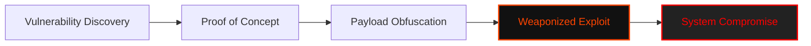

<p align="center">
  
</p>

<p align="center">
<pre>
▓█████ ▒██   ██▒ ██▓███   ██▓     ▒█████   ██▓▄▄▄█████▓  ██████ 
▓█   ▀ ▒▒ █ █ ▒░▓██░  ██▒▓██▒    ▒██▒  ██▒▓██▒▓  ██▒ ▓▒▒██    ▒ 
▒███   ░░  █   ░▓██░ ██▓▒▒██░    ▒██░  ██▒▒██▒▒ ▓██░ ▒░░ ▓██▄   
▒▓█  ▄  ░ █ █ ▒ ▒██▄█▓▒ ▒▒██░    ▒██   ██░░██░░ ▓██▓ ░   ▒   ██▒
░▒████▒▒██▒ ▒██▒▒██▒ ░  ░░██████▒░ ████▓▒░░██░  ▒██▒ ░ ▒██████▒▒
░░ ▒░ ░▒▒ ░ ░▓ ░▒▓▒░ ░  ░░ ▒░▓  ░░ ▒░▒░▒░ ░▓    ▒ ░░   ▒ ▒▓▒ ▒ ░
 ░ ░  ░░░   ░▒ ░░▒ ░     ░ ░ ▒  ░  ░ ▒ ▒░  ▒ ░    ░    ░ ░▒  ░ ░
   ░    ░    ░  ░░         ░ ░   ░ ░ ░ ▒   ▒ ░  ░      ░  ░  ░  
   ░  ░ ░    ░               ░  ░    ░ ░   ░                 ░
</pre>
</p>

<div align="center">

# <samp>Sector_0x01: Weaponized_Logic</samp>

**<samp>Advanced Exploit Archive | CVE Weaponization | Custom Zero-Days & PoCs</samp>**

<br>

<samp>Operative: <a href="https://github.com/fsoc-ghost-0x">C0deGhost</a> | Status: <font color="#ff4500">READY_TO_FIRE</font> | Classification: <font color="#888888">TOP_SECRET</font></samp>

</div>

<div align="center">


</div>

---

<details>
<summary><code>Accessing Exploit Intel...</code></summary>

- [▌ 0x01_EXPLOIT_ANALYSIS](#-0x01_exploit_analysis)
- [▌ 0x02_ARSENAL_CLASSIFICATION](#-0x02_arsenal_classification)
- [▌ 0x03_WEAPONIZATION_FLOW](#-0x03_weaponization_flow)
- [▌ 0x04_USAGE_&_CAUTION](#-0x04_usage__caution)
- [▌ 0x05_LEGAL_DISCLAIMER](#-0x05_legal_disclaimer)

</details>

<br>

## <samp>▌ <u>0x01_EXPLOIT_ANALYSIS</u></samp>

<details open>
  <summary><code>Decrypting Sector Intel...</code></summary>
  
  ### <samp>The Philosophy of Subversion</samp>

  <samp>
  An exploit is not just a script. It is the surgical application of logic to a flaw that shouldn't exist. In this sector, we archive the tools that turn "vulnerabilities" into "access." 
  
  From memory corruption to logical bypasses, <code>Sector_0x01</code> contains the payloads that force the system to obey a different master. We don't wait for patches; we find the cracks they missed.
  </samp>

  ### <samp>Technical Scope</samp>
  
  **<samp>1. CVE Weaponization:</samp>** <samp>Turning public advisories (NVD/GitHub) into ready-to-fire Python, C++, and Go weapons.</samp>
  **<samp>2. LPE (Local Privilege Escalation):</samp>** <samp>Vectors designed to break out of low-privilege shells and seize #root/SYSTEM control.</samp>
  **<samp>3. Custom PoCs:</samp>** <samp>Unique exploitation logic developed through deep security research and reverse engineering.</samp>
  
  <div align="center">
    <br>
    <i><font color="#888888" face="monospace">"A bug is only a bug until it's an exploit. Then, it's a key."</font></i>
  </div>

</details>

<br>

## <samp>▌ <u>0x02_ARSENAL_CLASSIFICATION</u></samp>

<samp>The exploits are categorized by target environment and disclosure type for rapid deployment:</samp>

| <samp>Category</samp> | <samp>Target Focus</samp> | <samp>Vector Types</samp> |
| :--- | :--- | :--- |
| <samp>💀 **CVE_ARCHIVE**</samp> | <samp>Public Disclosures</samp> | <samp>RCE, Auth Bypass, and Logic Flaws with documented CVE IDs.</samp> |
| <samp>🌐 **WEB**</samp> | <samp>AppSec & APIs</samp> | <samp>Insecure Deserialization, Advanced SQLi, SSRF Chains, XSTI.</samp> |
| <samp>🐧 **LINUX**</samp> | <samp>Kernel & SUID</samp> | <samp>Kernel UAF, SUID Abuse, GTFOBins, Shared Library Injection.</samp> |
| <samp>🪟 **WINDOWS**</samp> | <samp>AD & Win-Internals</samp> | <samp>NTLM Coercion, PrintSpooler, GPO Abuse, Token Manipulation.</samp> |

<br>

## <samp>▌ <u>0x03_WEAPONIZATION_FLOW</u></samp>



<br>

## <samp>▌ <u>0x04_USAGE_&_CAUTION</u></samp>

<details>
  <summary><code>View Execution Protocol...</code></summary>
  
  ### <samp>1. Environment Setup</samp>
  <samp>Always run exploits in an isolated, audited environment. Telemetry is the enemy. Ensure all dependencies are met within the <code>.vault</code> virtual environment.</samp>
  
  ```bash
  # Example: Preparing a CVE-based exploit
  cd Sector_0x01/CVE-XXXX-XXXX
  python3 exploit.py --target <IP> --payload <CMD>
  ```

  ### <samp>2. Payload Customization</samp>
  <samp>Most exploits in this sector allow for custom LHOST/LPORT or command injection strings. Edit the configuration block within each script before firing.</samp>
  
</details>

<br>

## <samp>▌ <u>0x05_LEGAL_DISCLAIMER</u></samp>
<samp>
The exploits contained in this directory are highly dangerous. They are intended for authorized red teaming, penetration testing, and academic research only. Use against unauthorized targets is strictly prohibited and illegal. C0deGhost is not responsible for any damage caused by the misuse of these tools.
</samp>
<br>
<i><font color="#888888" face="monospace">"Control is an illusion. This code is the reality."</font></i>

---

<p align="center">
  <samp><strong><font color="#ff4500">WE ARE FSOCIETY. WE ARE FINALLY FREE. WE ARE FINALLY AWAKE.</font></strong></samp>
</p>
