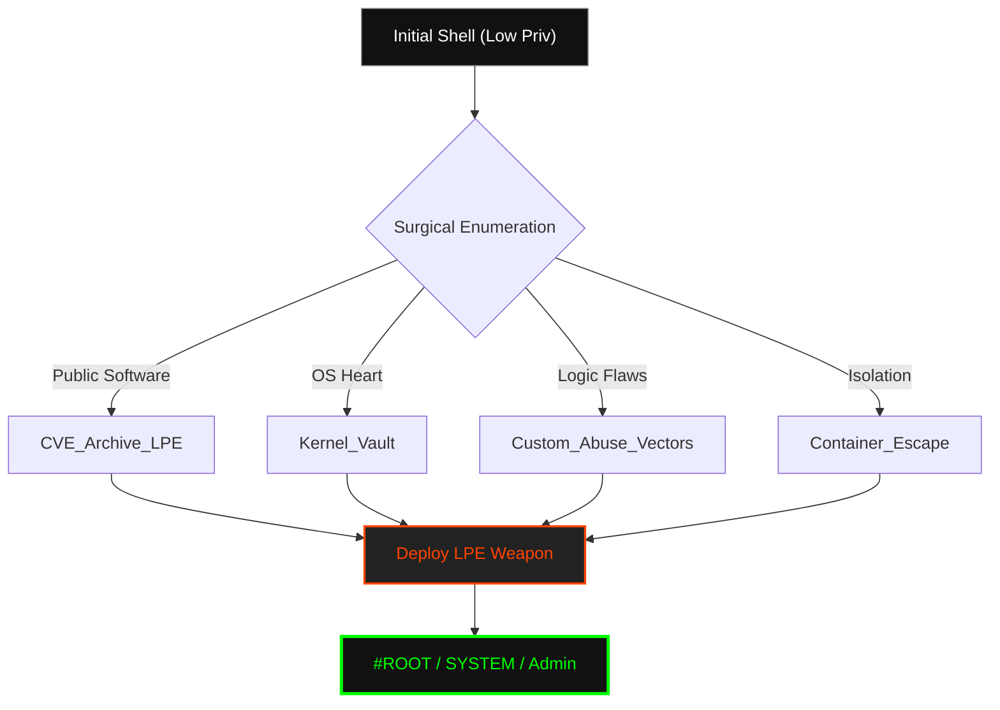

<p align="center">
  
</p>

<p align="center">
<pre>
███████╗███████╗ ██████╗  ██████╗██╗███████╗████████╗██╗   ██╗
██╔════╝██╔════╝██╔═══██╗██╔════╝██║██╔════╝╚══██╔══╝╚██╗ ██╔╝
█████╗  ███████╗██║   ██║██║     ██║█████╗     ██║    ╚████╔╝ 
██╔══╝  ╚════██║██║   ██║██║     ██║██╔══╝     ██║     ╚██╔╝  
██║     ███████║╚██████╔╝╚██████╗██║███████╗   ██║      ██║   
╚═╝     ╚══════╝ ╚═════╝  ╚═════╝╚═╝╚══════╝   ╚═╝      ╚═╝   
</pre>
</p>

<div align="center">

# <samp>Sector_0x02: Vertical_Incursion.dat</samp>

**<samp>Advanced LPE Matrix | Kernel Land Subversion | Logical Boundary Escapes</samp>**

<br>

<samp>Architect: <a href="https://github.com/fsoc-ghost-0x">C0deGhost</a> | Version: 2.1.0 (Surgical) | Clearance: <font color="#ff4500">ADMINISTRATOR</font></samp>

</div>

<div align="center">


</div>

---

<details>
<summary><code>Click to view Sector Navigation Matrix</code></summary>

<br>

- [▌ 0x01_ANALYSIS_&_OPERATIONAL_DOCTRINE](#-0x01_analysis__operational_doctrine)
- [▌ 0x02_MITRE_ATT&CK_MAPPING](#-0x02_mitre_attck_mapping)
- [▌ 0x03_VERTICAL_INCURSION_TREE](#-0x03_vertical_incursion_tree)
- [▌ 0x04_TACTICAL_SECTORS_OVERVIEW](#-0x04_tactical_sectors_overview)
- [▌ 0x05_EXECUTION_&_DOMINANCE_FLOW](#-0x05_execution__dominance_flow)
- [▌ 0x06_LEGAL_DISCLAIMER](#-0x06_legal_disclaimer)

</details>

<br>

## <samp>▌ <u>0x01_ANALYSIS_&_OPERATIONAL_DOCTRINE</u></samp>

<details open>
  <summary><code>Decrypting Vertical Intel...</code></summary>
  
  ### <samp>Executive Summary</samp>

  <samp>
  Initial access is merely the invitation; <code>Sector_0x02</code> is the hostile takeover. This sector archives the methodology and weaponized code required to break the boundaries of unprivileged accounts and seize absolute control of the operating system.
  
  The transition from a low-level shell to <strong>#root</strong> or <strong>SYSTEM</strong> is executed through three primary paths: Documented software flaws (CVEs), Ring 0 subversion (Kernel), and the exploitation of proprietary logic (Custom Vectors).
  </samp>

  ### <samp>The Philosophy of Ascension</samp>
  
  <samp>
  In an era of EDR dominance, simple exploits are not enough. We target the <strong>Logic of the Environment</strong>. From abusing misconfigured SUIDs in Linux to hijacking COM objects and deploying vulnerable drivers (BYOVD) in Windows, we turn the system's own features against its security.
  </samp>
  
  <div align="center">
    <br>
    <i><font color="#888888" face="monospace">"In the kingdom of the blind, the one with #root is King."</font></i>
  </div>

</details>

<br>

## <samp>▌ <u>0x02_MITRE_ATT&CK_MAPPING</u></samp>

- **<samp>Tactic:</samp>** <samp><a href="https://attack.mitre.org/tactics/TA0004/">Privilege Escalation</a></samp>
- **<samp>Technique:</samp>** <samp><a href="https://attack.mitre.org/techniques/T1068/">Exploitation for Privilege Escalation</a></samp>
- **<samp>Technique:</samp>** <samp><a href="https://attack.mitre.org/techniques/T1548/">Abuse Elevation Control Mechanism</a></samp>

<br>

## <samp>▌ <u>0x03_VERTICAL_INCURSION_TREE</u></samp>

<samp>The structural hierarchy of the LPE arsenal is organized into deterministic cells for surgical retrieval:</samp>

```text
0x02_LPE/
├── 0x01_CVE_Archive_LPE/                 # Publicly documented software/service flaws
│   ├── 2022/                             # Legacy Infrastructure / CTF baseline
│   ├── 2023/
│   ├── 2024/
│   ├── 2025/
│   └── 2026/                             # Frontline: Zero-days & critical patches
├── 0x02_Kernel_Vault/                    # Ring 0 - The System Heart (CVEs & PoCs)
│   ├── Linux_Kernels/                    # Categorized by Kernel version (v5.x, v6.x)
│   └── Windows_Kernels/                  # Categorized by Build (Win10, Win11, Server)
├── 0x03_Custom_Abuse_Vectors/            # Logical Incursion: Human & Config flaws
│   ├── Linux/
│   │   ├── SUID_SGID_Abuse/              # Binary permission subversion
│   │   ├── Sudoers_Misconfig/            # LD_PRELOAD, Wildcards, NOPASSWD
│   │   ├── Capabilities_Vectors/         # cap_setuid, cap_net_raw, etc.
│   │   ├── Cron_&_Timers/                # Race conditions in scheduled tasks
│   │   ├── System_Logic_&_Environment/   # Path Hijacking, Symlinks, Shared Libs
│   │   ├── Container_Breakout_Escape/    # Docker, LXC, K8s, Runc (Cloud/CTF focus)
│   │   ├── Custom_Scripts_Exploits/       # Python, C, Bash script injections
│   │   ├── Custom_Apps_Exploits/          # In-house / Proprietary binary flaws
│   │   └── Custom_Tech_Stack_Exploits/    # Specialized library/framework subversion
│   └── Windows/
│       ├── 0x0A_Token_Manipulation/       # SeImpersonate, Potato Family
│       ├── 0x0B_User_Group_Privileges/    # SeBackup, SeRestore, SeDebug abuse
│       ├── 0x0C_BYOVD_Exploitation/       # Bring Your Own Vulnerable Driver (Kernel)
│       ├── 0x0D_COM_Hijacking/            # Component Object Model hijacking (Registry)
│       ├── 0x0E_Service_Permissions/      # Unquoted Paths, Weak ACLs
│       ├── 0x0F_DLL_Hijacking/            # Sideloading, Proxying, Phantom DLLs
│       ├── 0x10_Registry_Abuse/           # AlwaysInstallElevated, IFEO, Winlogon
│       ├── 0x11_System_Logic_&_Env/       # User/System Env var manipulation
│       ├── 0x12_Privileged_File_Ops/      # Arbitrary Write/Delete, Junctions
│       ├── 0x13_Container_Breakout/       # WSL2, Docker Desktop, Hyper-V escapes
│       ├── 0x14_Custom_Scripts_Exploits/  # PS1, VBS, BAT admin task subversion
│       ├── 0x15_Custom_Apps_Exploits/     # Corporate in-house software flaws
│       ├── 0x16_Custom_Tech_Stack/        # Framework-specific (.NET, etc.)
│       └── 0x17_Active_Directory_LPE/     # LAPS, GPP, Credential Caching
└── Web_Logic_Escalation/                 # Vertical escalation (User -> Admin)
```

<br>

## <samp>▌ <u>0x04_TACTICAL_SECTORS_OVERVIEW</u></samp>

| <samp>Sector</samp> | <samp>Classification</samp> | <samp>Operational Focus</samp> |
| :--- | :--- | :--- |
| <samp>📂 **CVE_ARCHIVE**</samp> | <samp>Historical</samp> | <samp>Weaponized public disclosures from 2022 to the current 2026 cycle.</samp> |
| <samp>📂 **KERNEL_VAULT**</samp> | <samp>Low-Level</samp> | <samp>Surgical Ring 0 exploits targeting memory management and drivers.</samp> |
| <samp>📂 **CUSTOM_ABUSE**</samp> | <samp>Logical</samp> | <samp>Exploiting the human factor: misconfigurations, weak permissions, and script flaws.</samp> |
| <samp>📂 **CONTAINER_ESC**</samp> | <samp>Isolation</samp> | <samp>Breaking out of Docker/WSL2/K8s to seize the host OS.</samp> |

<br>

## <samp>▌ <u>0x05_EXECUTION_&_DOMINANCE_FLOW</u></samp>



<br>

## <samp>▌ <u>0x06_LEGAL_DISCLAIMER</u></samp>
<samp>
The content of <code>Sector_0x02</code> is intended for authorized security testing, professional red teaming, and educational research only. Unauthorized escalation of privileges is a felony. C0deGhost and Fsociety do not assume liability for the misuse of these surgical instruments.
</samp>
<br>
<i><font color="#888888" face="monospace">"Control is an illusion. Vertical incursion is the reality."</font></i>

---

<p align="center">
  <samp><strong><font color="#ff4500">WE ARE FSOCIETY. WE ARE FINALLY FREE. WE ARE FINALLY AWAKE.</font></strong></samp>
</p>
